# Gharsaty – Smart Agricultural Platform

> Graduation Project – Final Evaluation: **90%**

Gharsaty is a smart agricultural platform designed to support the Palestinian agricultural sector by connecting **farmers**, **customers**, **admins**, and **business managers** through one integrated ecosystem. The project was built to solve real market problems such as unstable prices, weak farmer access to buyers, crop loss risks, and the absence of data-driven agricultural planning.

The platform helps organize the agricultural market, improve decision-making, protect farmers from preventable losses, and support more stable and fair pricing through market analysis, crop recommendations, weather insights, and digital marketplace services.

---

## Project Vision

The main vision behind Gharsaty is to build a digital agricultural ecosystem that:

- Supports farmers in planning and selling more effectively.
- Helps reduce crop loss through weather awareness and better decisions.
- Contributes to market regulation and price stability.
- Connects customers directly with trusted farmers and their products.
- Provides administrators and business managers with tools for monitoring, analysis, and platform control.

---

## Problem Statement

Traditional agricultural workflows often face several challenges:

- Farmers may plant without clear visibility into market demand.
- Sudden weather conditions can negatively affect crops.
- Weak access to direct customers can reduce farmer profit.
- Market imbalance can lead to oversupply, shortages, and price instability.
- Agricultural stakeholders often lack centralized digital tools for analysis and management.

Gharsaty addresses these problems through a multi-role platform powered by real agricultural logic, analytics, and marketplace functionality.

---

## System Users

Gharsaty serves four major user roles:

### 1. Customer
Customers can browse the agricultural marketplace, explore farms and products, place orders, view farm locations on maps, and interact with the platform through a simple digital buying experience.

### 2. Farmer
Farmers can create and manage farm profiles, list crops, receive weather information, benefit from agricultural recommendations, monitor reservations, and make more informed production decisions.

### 3. Admin
Admins are responsible for platform supervision, validation processes, monitoring requests, and controlling core system operations.

### 4. Business Manager
Business managers use advanced dashboards and market analysis tools to monitor agricultural trends, study supply-demand patterns, review platform activity, and support market stability decisions.

---

## Core Features

### Farmer Side
- Farm profile creation and management
- Crop listing and marketplace publishing
- Weather tracking and alerts
- Agricultural recommendations
- Reservation and order follow-up
- Farm verification workflow
- Access to market insights and analytics

### Customer Side
- Browse crops in the marketplace
- View product and farm details
- Add items to cart
- Place orders and reservations
- Explore farm locations using maps
- Register and manage account details

### Admin & Business Manager Side
- Dashboard and platform management
- Market analysis and reporting
- Customer order monitoring
- Farmer order and request management
- Farm verification and approval workflows
- Oversight tools for improving supply balance and pricing stability

---

## Business Value

Gharsaty is more than a marketplace. It is a decision-support and regulation-support platform designed to:

- Improve fairness in agricultural trade
- Reduce dependence on unstructured traditional selling channels
- Help stabilize agricultural prices
- Reduce waste and crop losses
- Provide digital visibility into farms, products, and market behavior
- Empower both farmers and buyers through direct, transparent interaction

---

## Technology Stack

The system was implemented using:

- **Android (Java)** for the mobile applications
- **PHP** for backend APIs and server-side logic
- **MySQL** for database management
- **Firebase** for selected real-time communication features
- **REST APIs** for communication between the mobile app, web dashboard, and backend services
- Hosted on **AwardSpace** servers

---

## Web Dashboard Screenshots

### Admin Dashboard
Shows the main control panel used by admins and business managers to monitor platform activity and key system operations.

  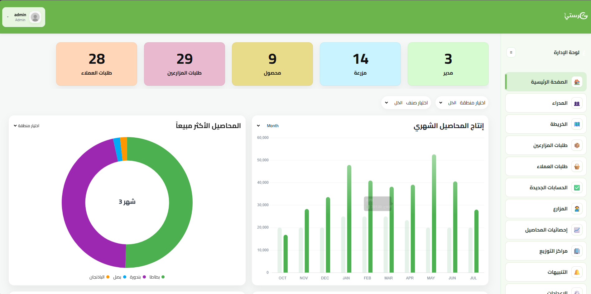

### Market Analytics Page
Displays agricultural and market insights that help monitor trends, demand, supply, and support more stable pricing decisions.

  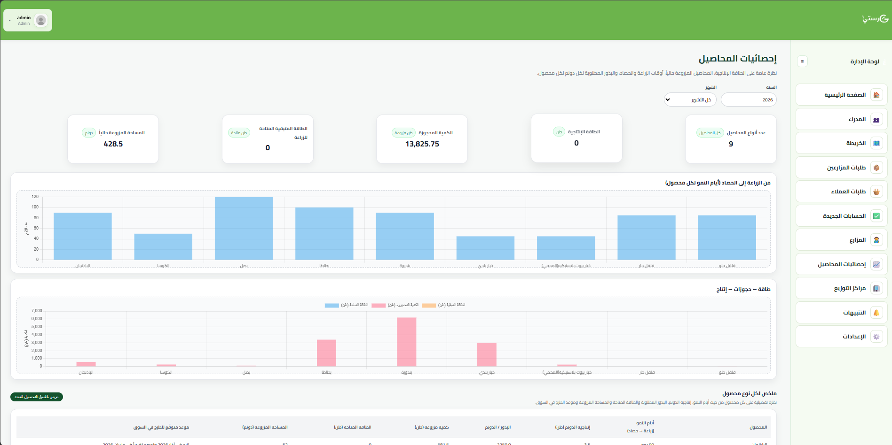

### Customer Orders Page
Shows customer orders and related operational data used for order monitoring and management.

  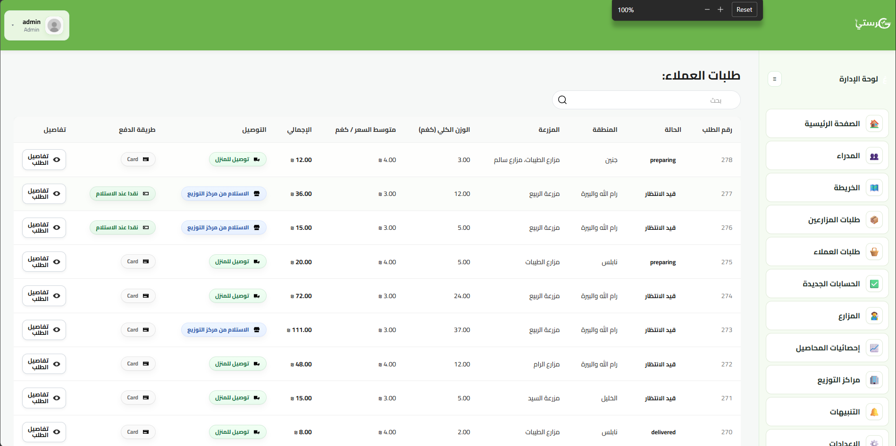

### Farmer Requests / Orders Page
Shows farmer-side requests, submissions, or operational records handled through the admin/business dashboard.

  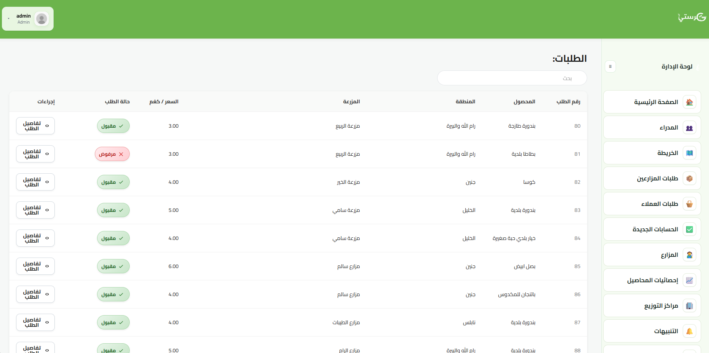

---

## Farmer Mobile App Screenshots

### Farmer Dashboard
The main home screen for farmers, providing quick access to their farm activity and major tools.

  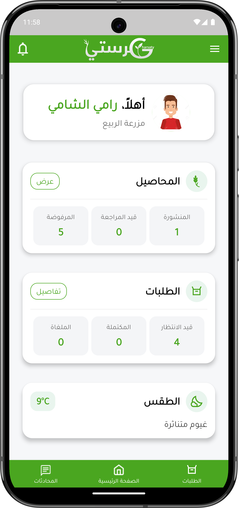

### Farmer Market Analytics
Helps farmers understand market direction and make better production and selling decisions.

  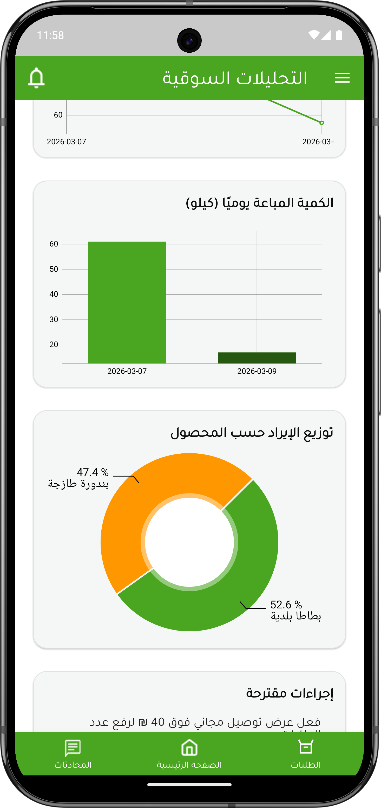

### Agricultural Recommendations & Reservations
Displays crop recommendations and reservation-related workflows that support smarter planning and selling.

  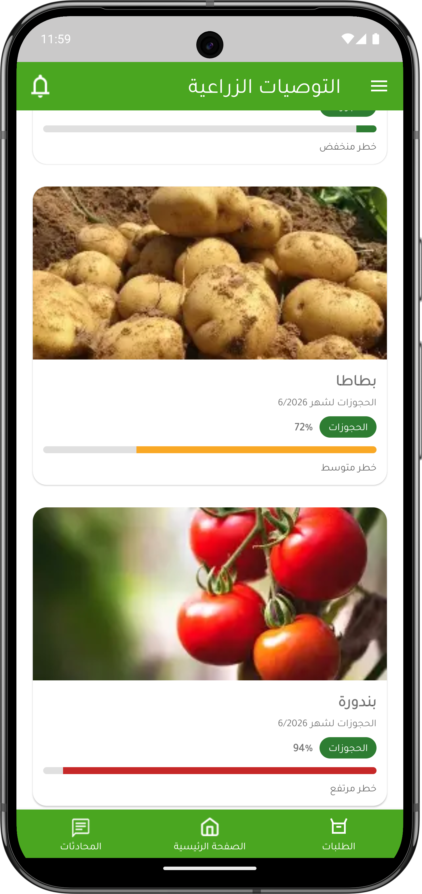

### Weather Page
Provides weather information and alerts to help farmers reduce risk and protect crops.

  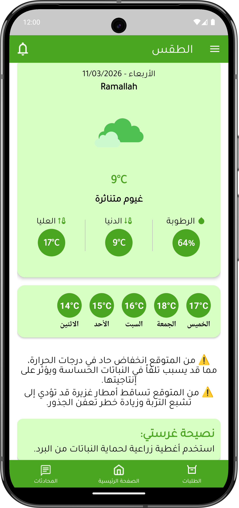

---

## Customer Mobile App Screenshots

### Marketplace
Shows the customer-facing marketplace where users can browse available crops and products.

  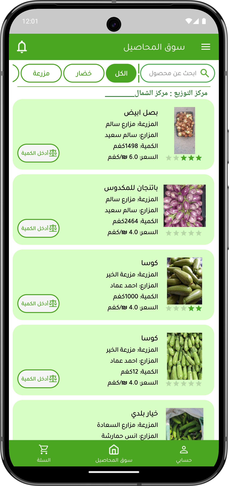

### Cart
Displays selected products before checkout or reservation confirmation.

  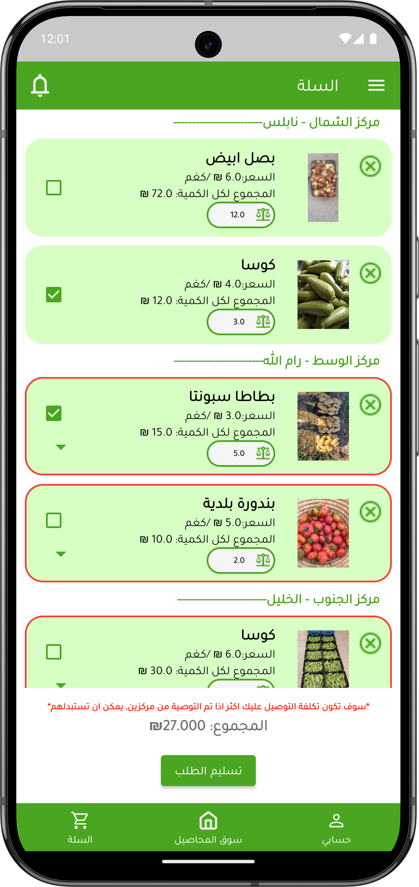

### Farm Maps
Allows customers to explore farm locations and interact with map-based farm discovery.

  

---

## Authentication & Onboarding Screenshots

### Login
User login interface for accessing the platform.

  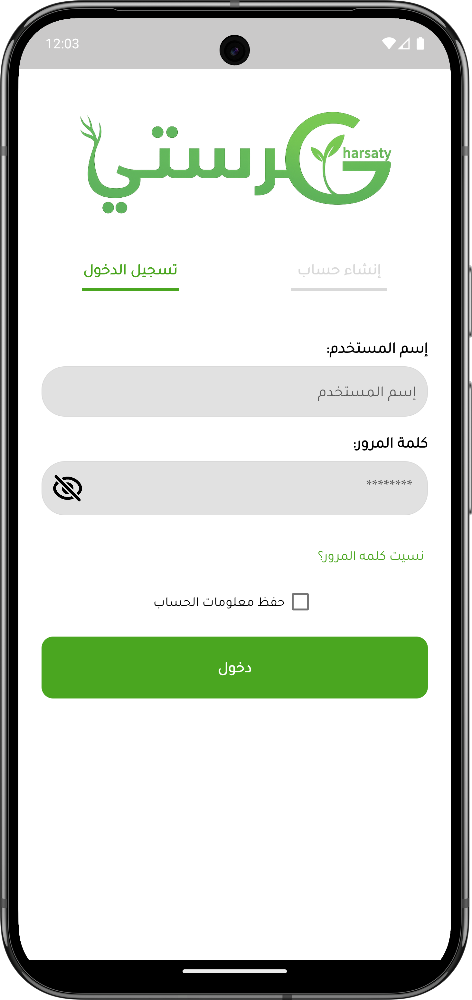

### Create Farm Profile
Used by farmers to build their farm identity and enter farm-related details.

  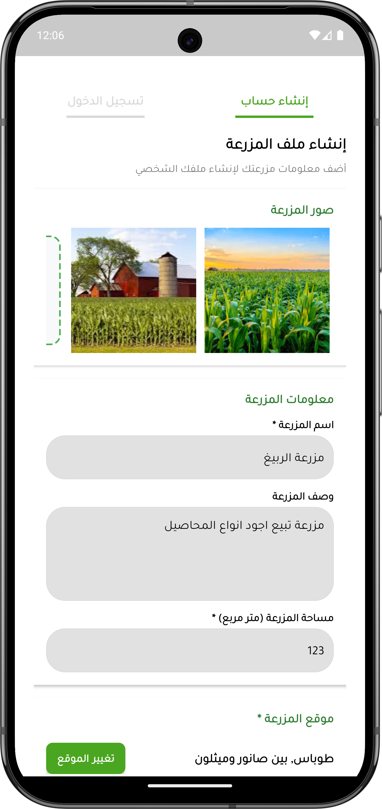

### Farm Verification
Shows the farm information verification step that supports trust and platform reliability.

  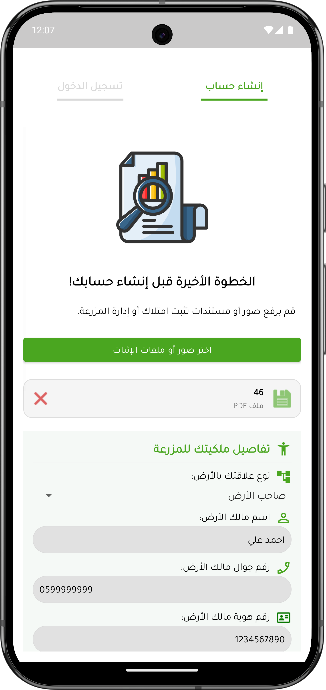

---

## License

This repository is presented as a **project showcase** for academic and portfolio purposes.

